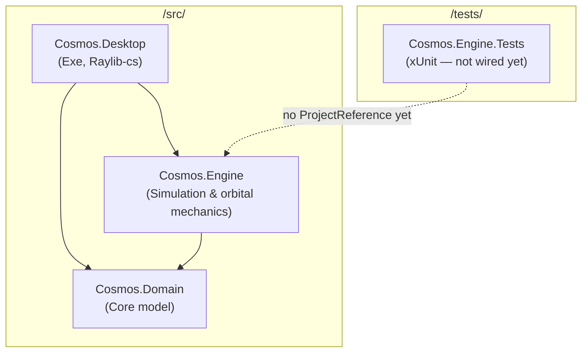

# Cosmos Engine — Solution Analysis

> Generated solution analysis covering project structure, responsibilities, entry point, dependencies, and architectural patterns.

---

## 1. What projects exist?

The solution `CosmosEngine.slnx` contains **four .NET 10 projects**, grouped as:

| Project | Type | Folder in solution |
|---|---|---|
| **Cosmos.Domain** | Class library | `/src/` |
| **Cosmos.Engine** | Class library | `/src/` |
| **Cosmos.Desktop** | Executable (`OutputType=Exe`) | `/src/` |
| **Cosmos.Engine.Tests** | xUnit test project | `/tests/` |

There is also a **`Docs/`** folder (architecture notes, ADRs, orbital-mechanics knowledge), but it is **not** a buildable project.

---

## 2. Responsibility of each project

### Cosmos.Domain

The **core domain model** — physics-agnostic entities and types with **zero project dependencies**.

- **Entities:** `Body`, `Spacecraft`, `Universe`
- **Value objects:** `Mass`, `ReferenceContext`
- **Structs:** `Vector2D`, `Vector3D`
- **Enums:** `BodyType`, `ReferenceFrame`
- **Domain concepts:** `Orbit` (orbital elements), navigation abstractions (`INavigationTarget`, `BodyNavigationTarget`)

This layer defines *what exists* in the simulation (bodies, universe, orbits) but not *how* physics or rendering work.

---

### Cosmos.Engine

The **simulation and orbital-mechanics engine** — application/domain services that operate on `Cosmos.Domain` types.

- **Physics:** `NewtonianPhysicsModel` (N-body gravity), `IPhysicsModel`
- **Integration:** `SemiImplicitEulerIntegrator`, `IIntegrator`
- **Calculators:** circular orbit, escape velocity, Hohmann transfer, orbital energy, sphere of influence, orbital statistics
- **Analysis:** `OrbitAnalyzer`, `OrbitAnalysis`
- **Maneuvers:** `ManeuverPlanner`, `ManeuverExecutionSystem`, `HohmannTransfer`, `ThrusterSystem`
- **Navigation:** `GuidanceComputer`, `NavigationSolution`
- **Tracking:** `OrbitalTracker`
- **Engine models:** `BurnExecutionState`, `ManeuverPlan`, statistics DTOs

Depends only on **Cosmos.Domain**.

---

### Cosmos.Desktop

The **presentation / host application** — Raylib-based 3D visualization, input, and the runtime game loop.

- **Entry & loop:** `Program.cs` (window init, update, render)
- **Rendering:** `UniverseRenderer`, `TrailRenderer`, `HudRenderer`
- **Input:** `InputHandler` (camera, pause, speed, thrusters, body selection)
- **Camera:** `Camera`
- **Data loading:** `UniverseLoader`, `StyleLoader` (JSON → domain entities)
- **Presentation DTOs:** `BodyDto`, `BodyStyleDto`, `VectorDto`
- **UI state:** `SimulationState` (camera, pause, speed, maneuver/burn state)
- **Styling:** `PlanetStyleProvider`, `BodyStyleConfig`

Depends on **Cosmos.Domain** and **Cosmos.Engine**, plus **Raylib-cs** (NuGet).

---

### Cosmos.Engine.Tests

A **placeholder test project** using xUnit, coverlet, and the .NET Test SDK.

Currently contains an empty `UnitTest1` and **does not yet reference `Cosmos.Engine`**, so it is not wired into the dependency graph yet.

---

## 3. Application entry point

**`Cosmos.Desktop`** is the application entry point.

- `Cosmos.Desktop.csproj` sets `<OutputType>Exe</OutputType>`
- `Cosmos.Desktop/Program.cs` is the `Main` entry (top-level statements)
- It bootstraps Raylib, loads JSON data, constructs physics/tracking/maneuver components, and runs the main simulation loop

---

## 4. Dependency graph



**Compile-time project references:**

```
Cosmos.Desktop  ──►  Cosmos.Engine  ──►  Cosmos.Domain
       │                                      ▲
       └──────────────────────────────────────┘
```

**NuGet dependencies (not shown as project nodes):**

- `Cosmos.Desktop` → Raylib-cs 8.0.0
- `Cosmos.Engine.Tests` → xUnit, Microsoft.NET.Test.Sdk, coverlet

---

## 5. Architectural patterns detected

### Primary: Layered / Clean Architecture (onion-style)

The solution follows a **three-layer separation** with dependency direction pointing inward:

| Layer | Project | Role |
|---|---|---|
| Domain (center) | Cosmos.Domain | Entities, value objects, domain types |
| Application / services | Cosmos.Engine | Physics, integrators, calculators, maneuvers |
| Presentation / host | Cosmos.Desktop | Rendering, input, JSON loading, game loop |

`Cosmos.Domain` has no outward dependencies; outer layers depend on inner ones. This matches **Clean Architecture** / **Hexagonal Architecture** intent, even though ports/adapters are not formalized with interfaces everywhere.

---

### Strategy pattern (physics & integration)

`IPhysicsModel` and `IIntegrator` abstract simulation behavior; `Program.cs` selects concrete implementations (`NewtonianPhysicsModel`, `SemiImplicitEulerIntegrator`). This allows swapping integrators or physics models without changing the host loop.

---

### Domain-Driven Design (lightweight)

Evidence includes:

- **Entities:** `Body`, `Universe`, `Spacecraft`
- **Value objects:** `Mass` (typed mass instead of raw `double`)
- **Domain enums:** `BodyType`, `ReferenceFrame`
- **Navigation abstractions** in the domain layer

It is not a full DDD implementation (no aggregates, repositories, or bounded contexts), but the vocabulary and structure follow DDD conventions.

---

### Game loop / simulation loop

`Program.cs` implements a classic **update → render** loop:

1. Handle input
2. Step physics (possibly multiple substeps via `SimulationSpeed`)
3. Update orbital tracking and maneuver execution
4. Render universe + HUD

This is the standard pattern for real-time simulation and game engines.

---

### Manual composition root (no DI container)

All services are **constructed and wired manually** in `Program.cs`. There is no IoC container; the host acts as the **composition root**. Comments in `Program.cs` indicate this wiring is provisional and intended for future refactoring.

---

### Data loader / adapter pattern (informal)

`UniverseLoader` and `StyleLoader` adapt external JSON (`DataFiles/solar-system.json`, `body-styles.json`) into domain objects. DTOs live in the Desktop layer, acting as **anti-corruption / mapping** between file format and domain.

---

### Service + calculator decomposition

Within `Cosmos.Engine`, responsibilities are split into focused units:

- **Services** (`NewtonianPhysicsModel`) — orchestrate simulation steps
- **Calculators** — pure orbital-mechanics math
- **Analysis / Navigation / Maneuvers** — higher-level mission logic

This resembles a **service layer** with **functional calculator helpers**, common in scientific/simulation codebases.

---

### Observations (architectural maturity)

- **Presentation coupling:** `SimulationState` (Desktop) holds engine types like `ManeuverPlan` and `BurnExecutionState`, so the UI layer is not fully decoupled from engine internals.
- **Tests not integrated:** `Cosmos.Engine.Tests` exists structurally but does not yet test the engine.
- **Procedural host:** `Program.cs` contains significant orchestration logic; architecture docs under `Docs/Project/Architecture/` are placeholders.
- **Overall:** A **learning-project layered architecture** evolving toward an orbital-mechanics simulator and mission-planning platform, with clear separation of domain, engine, and desktop concerns but room to formalize boundaries (DI, test wiring, infrastructure vs. presentation).
